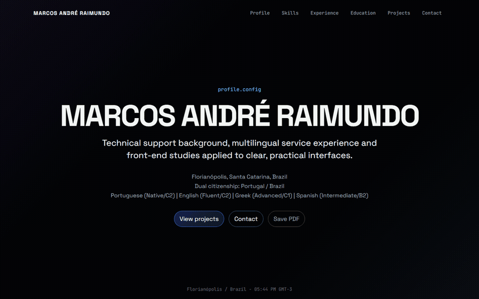
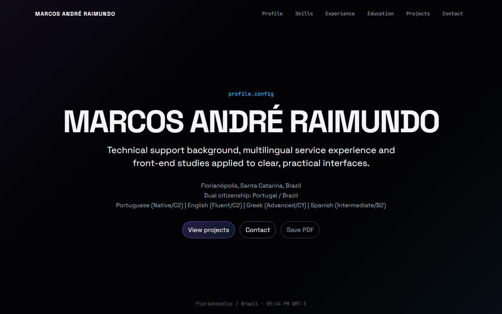
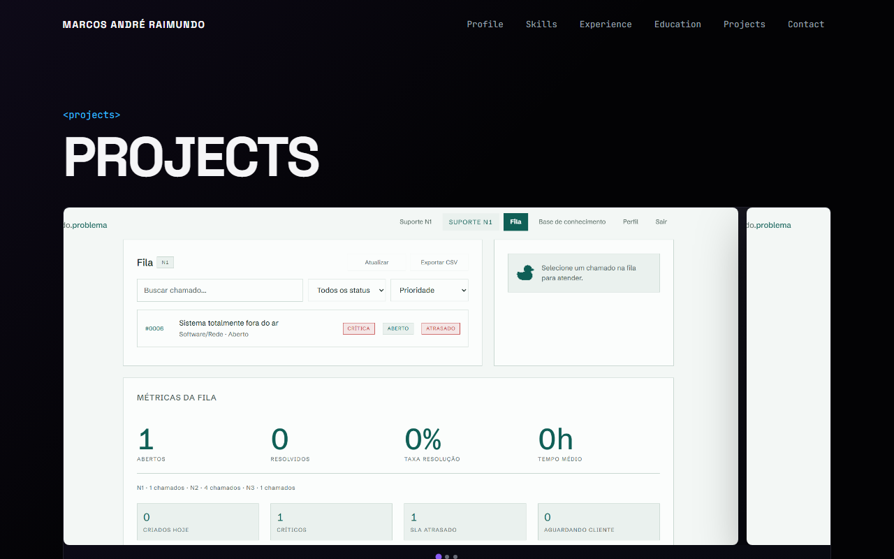
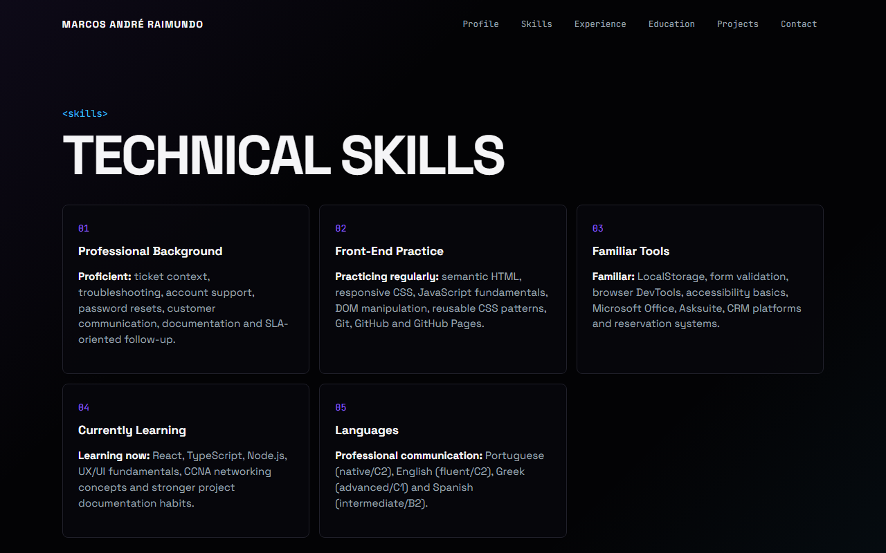
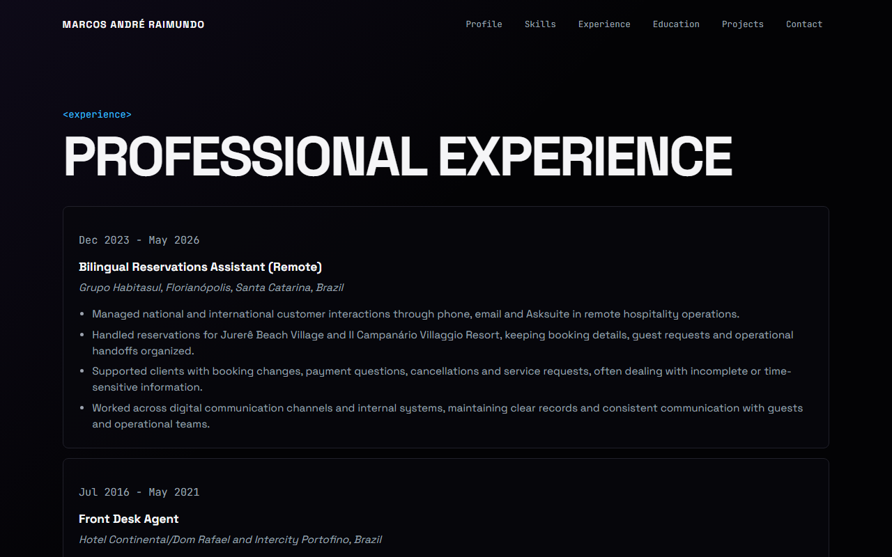
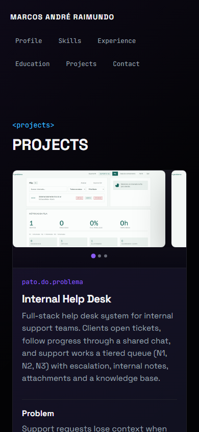
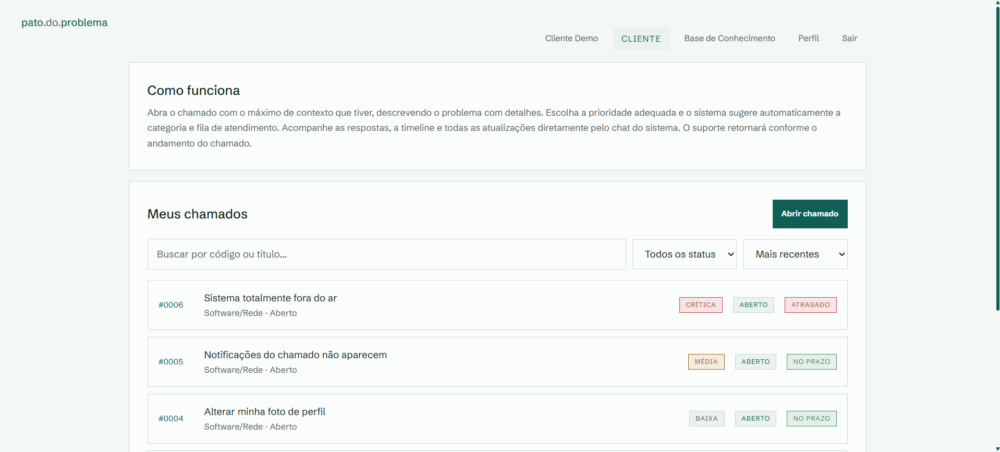

# professional-profile

Portfólio pessoal de Marcos André Raimundo com estilo dark code-inspired, construído sem framework e sem etapa de build. Vanilla HTML, CSS e JavaScript.



<p>
  
  
</p>

<p>
  
  
</p>

**Mobile (390px):**



---

## Sobre o projeto

O objetivo era ter um portfólio que qualquer dev consegue abrir no DevTools e entender em minutos — sem camadas de abstração, sem dependências escondidas. Cada decisão foi tomada pensando em legibilidade e facilidade de explicar numa entrevista.

O carrossel da aba Projects foi construído com CSS nativo, sem biblioteca. A navegação por pontos detecta qual imagem está visível automaticamente. O PDF do currículo é gerado direto pelo browser, sem intermediários.

As fontes foram escolhidas com intenção: JetBrains Mono nas labels e tags dá a sensação de editor de código; Space Grotesk no conteúdo de leitura mantém o texto legível. O layout mobile foi tratado com o mesmo cuidado que o desktop — a maioria dos recrutadores abre links do LinkedIn no celular.

---

## Projeto em destaque — pato.do.problema

<p>
  
  
  
</p>

Sistema de help desk interno desenvolvido do zero: FastAPI, Python, HTML, CSS e JavaScript vanilla. Autenticação real com JWT, fila de atendimento em três níveis (N1, N2, N3), chat por chamado, notas internas, base de conhecimento e integração opcional com a API da Anthropic para sugestão de resposta e resumo de escalada.

---

## Estrutura

```
.
├── assets/
│   ├── preview/          ← screenshots para este README
│   ├── projects/         ← imagens dos projetos (uma pasta por projeto)
│   ├── scripts/
│   └── styles/
├── tests/
├── index.html
├── profile.html
├── skills.html
├── experience.html
├── education.html
├── projects.html
└── contact.html
```
